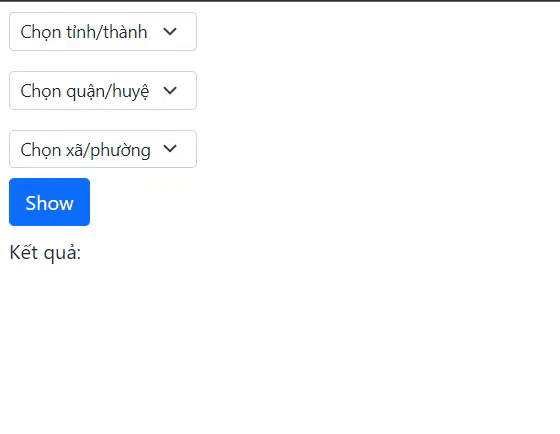

# Vietnam Administrative Divisions - Đơn vị thành chính Việt Nam

[](https://www.npmjs.com/package/vn-ad)
[](https://github.com/winofwin292/vn-ad)

Cung cấp các thành phần và các hàm hỗ trợ tích hợp đơn vị hành chính vào dự án ReactJS.

-   Dữ liệu được lấy từ https://github.com/madnh/hanhchinhvn (có chỉnh sửa).
-   Dữ liệu đơn vị hành chính được cập nhật đến ngày 5/5/2022.

## Cài đặt

```
$ npm install vn-ad
```

## Demo

Demo sử dụng vn-ad và Bootstrap 5



## Sử dụng

```js
import React, { useState } from "react";
import { SelectProvince, SelectDistrict, SelectCommune } from "vn-ad";

export default function Example() {
    //Biến lưu trữ mã đơn vị hành chính
    const [tinh, setTinh] = useState("-1");
    const [huyen, setHuyen] = useState("-1");
    const [xa, setXa] = useState("-1");
    //Biến lưu trữ kết quả
    const [result, setResult] = useState("");

    const handleShow = () => {
        setResult(getCommunePathWithType(xa));
    };

    return (
        <>
            <SelectProvince value={tinh} onChange={setTinh} />
            <SelectDistrict value={huyen} province={tinh} onChange={setHuyen} />
            <SelectCommune value={xa} district={huyen} onChange={setXa} />
            <button onClick={handleShow}>Show</button>
            <p>Kết quả: {result}</p>
        </>
    );
}
```

## Thành phần

### `<SelectProvince />`

Thuộc tính:

-   value (bắt buộc): giá trị nhận vào kiểu **_string_**. Dùng để lưu trữ mã tỉnh/thành phố khi chọn tỉnh/thành phố.
-   onChange (bắt buộc): giá trị nhận vào kiểu **_func_**. Dùng để đặt giá trị mới cho **_value_** khi chọn tỉnh/thành phố.

### `<SelectDistrict />`

Thuộc tính:

-   value (bắt buộc): giá trị nhận vào kiểu **_string_**. Dùng để lưu trữ mã quận/huyện khi chọn quận/huyện.
-   onChange (bắt buộc): giá trị nhận vào kiểu **_func_**. Dùng để đặt giá trị mới cho **_value_** khi chọn quận/huyện.
-   province: giá trị nhận vào kiểu **_string_**. Mã tỉnh/thành phố dùng để lọc danh sách quận/huyện được chọn theo tỉnh, nếu không truyền sẽ cho phép chọn tất cả các quận/huyện ở Việt Nam.

### `<SelectCommune />`

-   value (bắt buộc): giá trị nhận vào kiểu **_string_**. Dùng để lưu trữ mã xã/phường khi chọn xã/phường.
-   onChange (bắt buộc): giá trị nhận vào kiểu **_func_**. Dùng để đặt giá trị mới cho **_value_** khi chọn xã/phường.
-   district: giá trị nhận vào kiểu **_string_**. Mã quận/huyện dùng để lọc danh sách xã/phường được chọn theo tỉnh, nếu không truyền sẽ cho phép chọn tất cả các xã/phường ở Việt Nam.

## Hàm

### `getAll()`

Trả về dữ liệu chứa tất cả các đơn vị hành chính hiện tại của Việt Nam.

### `getAllProvince()`

Trả về dữ liệu chứa tất cả các tỉnh/thành phố hiện tại của Việt Nam.

Dữ liệu trả về:

```json
[
    {
        "name": "Hà Nội",
        "slug": "ha-noi",
        "type": "thanh-pho",
        "name_with_type": "Thành phố Hà Nội",
        "code": "01"
    }
]
```

### `findProvinceByCode(pcode)`

Trả về dữ liệu chứa tỉnh/thành phố có mã giống với mã được truyền vào. Nếu không tìm thấy sẽ trả về danh sách rỗng **[]**.

Dữ liệu trả về:

```json
[
    {
        "name": "Hà Nội",
        "slug": "ha-noi",
        "type": "thanh-pho",
        "name_with_type": "Thành phố Hà Nội",
        "code": "01"
    }
]
```

### `findProvinceByName(pname)`

Trả về dữ liệu chứa tỉnh/thành phố có tên giống với tên được truyền vào. Nếu không tìm thấy sẽ trả về danh sách rỗng **[]**.

Dữ liệu trả về:

```json
[
    {
        "name": "Hà Nội",
        "slug": "ha-noi",
        "type": "thanh-pho",
        "name_with_type": "Thành phố Hà Nội",
        "code": "01"
    }
]
```

### `getProvinceName(pcode)`

Trả về tên của tỉnh/thành phố có mã giống với mã được truyền vào. Nếu không tìm thấy sẽ trả về chuỗi rỗng **""**.

Dữ liệu trả về:

```
"Hà Nội"
```

### `getProvinceNameWithType(pcode)`

Trả về tên đầy đủ của tỉnh/thành phố có mã giống với mã được truyền vào. Nếu không tìm thấy sẽ trả về chuỗi rỗng **""**.

Dữ liệu trả về:

```
"Thành phố Hà Nội"
```

### `getAllDistrict()`

Trả về dữ liệu chứa tất cả các quận/huyện hiện tại của Việt Nam.

Dữ liệu trả về:

```json
[
    {
        "name": "Ba Đình",
        "type": "quan",
        "slug": "ba-dinh",
        "name_with_type": "Quận Ba Đình",
        "path": "Ba Đình, Hà Nội",
        "path_with_type": "Quận Ba Đình, Thành phố Hà Nội",
        "code": "001",
        "parent_code": "01"
    }
]
```

### `findDistrictByCode(dcode)`

Trả về dữ liệu chứa quận/huyện có mã giống với mã được truyền vào. Nếu không tìm thấy sẽ trả về danh sách rỗng **[]**.

Dữ liệu trả về:

```json
[
    {
        "name": "Ba Đình",
        "type": "quan",
        "slug": "ba-dinh",
        "name_with_type": "Quận Ba Đình",
        "path": "Ba Đình, Hà Nội",
        "path_with_type": "Quận Ba Đình, Thành phố Hà Nội",
        "code": "001",
        "parent_code": "01"
    }
]
```

### `findDistrictByName(dname)`

Trả về dữ liệu chứa quận/huyện có tên giống với tên được truyền vào. Nếu không tìm thấy sẽ trả về danh sách rỗng **[]**.

Dữ liệu trả về:

```json
[
    {
        "name": "Ba Đình",
        "type": "quan",
        "slug": "ba-dinh",
        "name_with_type": "Quận Ba Đình",
        "path": "Ba Đình, Hà Nội",
        "path_with_type": "Quận Ba Đình, Thành phố Hà Nội",
        "code": "001",
        "parent_code": "01"
    }
]
```

### `getDistrictName(dcode)`

Trả về tên của quận/huyện có mã giống với mã được truyền vào. Nếu không tìm thấy sẽ trả về chuỗi rỗng **""**.

Dữ liệu trả về:

```
"Ba Đình"
```

### `getDistrictNameWithType()`

Trả về tên đầy đủ của quận/huyện có mã giống với mã được truyền vào. Nếu không tìm thấy sẽ trả về chuỗi rỗng **""**.

Dữ liệu trả về:

```
"Quận Ba Đình"
```

### `getListDistrictByParentCode(pcode)`

Trả về dữ liệu chứa quận/huyện thuộc tỉnh có mã được truyền vào. Nếu không tìm thấy sẽ trả về danh sách rỗng **[]**.

Dữ liệu trả về:

```json
[
    {
        "name": "Ba Đình",
        "type": "quan",
        "slug": "ba-dinh",
        "name_with_type": "Quận Ba Đình",
        "path": "Ba Đình, Hà Nội",
        "path_with_type": "Quận Ba Đình, Thành phố Hà Nội",
        "code": "001",
        "parent_code": "01"
    }
]
```

### `getDistrictPath(dcode)`

Trả về địa chỉ của quận/huyện có mã giống với mã được truyền vào. Nếu không tìm thấy sẽ trả về chuỗi rỗng **""**.

Dữ liệu trả về:

```
"Ba Đình, Hà Nội"
```

### `getDistrictPathWithType(dcode)`

Trả về địa chỉ đầy đủ của quận/huyện có mã giống với mã được truyền vào. Nếu không tìm thấy sẽ trả về chuỗi rỗng **""**.

Dữ liệu trả về:

```
"Quận Ba Đình, Thành phố Hà Nội"
```

### `getAllCommune()`

Trả về dữ liệu chứa tất cả các phường/xã hiện tại của Việt Nam.

Dữ liệu trả về:

```json
[
    {
        "name": "Phúc Xá",
        "type": "phuong",
        "slug": "phuc-xa",
        "name_with_type": "Phường Phúc Xá",
        "path": "Phúc Xá, Ba Đình, Hà Nội",
        "path_with_type": "Phường Phúc Xá, Quận Ba Đình, Thành phố Hà Nội",
        "code": "00001",
        "parent_code": "001"
    }
]
```

### `findCommuneByCode(ccode)`

Trả về dữ liệu chứa phường/xã có mã giống với mã được truyền vào. Nếu không tìm thấy sẽ trả về danh sách rỗng **[]**.

Dữ liệu trả về:

```json
[
    {
        "name": "Phúc Xá",
        "type": "phuong",
        "slug": "phuc-xa",
        "name_with_type": "Phường Phúc Xá",
        "path": "Phúc Xá, Ba Đình, Hà Nội",
        "path_with_type": "Phường Phúc Xá, Quận Ba Đình, Thành phố Hà Nội",
        "code": "00001",
        "parent_code": "001"
    }
]
```

### `findCommuneByName(cname)`

Trả về dữ liệu chứa phường/xã có tên giống với tên được truyền vào. Nếu không tìm thấy sẽ trả về danh sách rỗng **[]**.

Dữ liệu trả về:

```json
[
    {
        "name": "Phúc Xá",
        "type": "phuong",
        "slug": "phuc-xa",
        "name_with_type": "Phường Phúc Xá",
        "path": "Phúc Xá, Ba Đình, Hà Nội",
        "path_with_type": "Phường Phúc Xá, Quận Ba Đình, Thành phố Hà Nội",
        "code": "00001",
        "parent_code": "001"
    }
]
```

### `getCommuneName(ccode)`

Trả về tên của phường/xã có mã giống với mã được truyền vào. Nếu không tìm thấy sẽ trả về chuỗi rỗng **""**.

Dữ liệu trả về:

```
"Phúc Xá"
```

### `getCommuneNameWithType(ccode)`

Trả về tên đầy đủ của phường/xã có mã giống với mã được truyền vào. Nếu không tìm thấy sẽ trả về chuỗi rỗng **""**.

Dữ liệu trả về:

```
"Phường Phúc Xá"
```

### `getListCommuneByParentCode(dcode)`

Trả về dữ liệu chứa phường/xã thuộc tỉnh có mã được truyền vào. Nếu không tìm thấy sẽ trả về danh sách rỗng **[]**.

Dữ liệu trả về:

```json
[
    {
        "name": "Phúc Xá",
        "type": "phuong",
        "slug": "phuc-xa",
        "name_with_type": "Phường Phúc Xá",
        "path": "Phúc Xá, Ba Đình, Hà Nội",
        "path_with_type": "Phường Phúc Xá, Quận Ba Đình, Thành phố Hà Nội",
        "code": "00001",
        "parent_code": "001"
    }
]
```

### `getCommunePath(ccode)`

Trả về địa chỉ của phường/xã có mã giống với mã được truyền vào. Nếu không tìm thấy sẽ trả về chuỗi rỗng **""**.

Dữ liệu trả về:

```
"Phúc Xá, Ba Đình, Hà Nội"
```

### `getCommunePathWithType(ccode)`

Trả về địa chỉ đầy đủ của quận/huyện có mã giống với mã được truyền vào. Nếu không tìm thấy sẽ trả về chuỗi rỗng **""**.

Dữ liệu trả về:

```
"Phường Phúc Xá, Quận Ba Đình, Thành phố Hà Nội"
```

### `getTreeByCode(pCode, dCode, cCode)`

Trả về **object** chứa thông tin của mã tỉnh/thành phố, quận/huyện, phường/xã được truyền vào. Nếu mã truyền vào không hợp lệ sẽ trả về **_null_**

Dữ liệu trả về:

```json
{
    "name": "Hà Nội",
    "slug": "ha-noi",
    "type": "thanh-pho",
    "name_with_type": "Thành phố Hà Nội",
    "code": "01",
    "quan-huyen": {
        "name": "Ba Đình",
        "type": "quan",
        "slug": "ba-dinh",
        "name_with_type": "Quận Ba Đình",
        "path": "Ba Đình, Hà Nội",
        "path_with_type": "Quận Ba Đình, Thành phố Hà Nội",
        "code": "001",
        "parent_code": "01",
        "xa-phuong": {
            "name": "Phúc Xá",
            "type": "phuong",
            "slug": "phuc-xa",
            "name_with_type": "Phường Phúc Xá",
            "path": "Phúc Xá, Ba Đình, Hà Nội",
            "path_with_type": "Phường Phúc Xá, Quận Ba Đình, Thành phố Hà Nội",
            "code": "00001",
            "parent_code": "001"
        }
    }
}
```

## License

MIT License

Copyright (c) <2022> Banh Quoc Thang

Permission is hereby granted, free of charge, to any person obtaining a copy
of this software and associated documentation files (the "Software"), to deal
in the Software without restriction, including without limitation the rights
to use, copy, modify, merge, publish, distribute, sublicense, and/or sell
copies of the Software, and to permit persons to whom the Software is
furnished to do so, subject to the following conditions:

The above copyright notice and this permission notice shall be included in all
copies or substantial portions of the Software.

THE SOFTWARE IS PROVIDED "AS IS", WITHOUT WARRANTY OF ANY KIND, EXPRESS OR
IMPLIED, INCLUDING BUT NOT LIMITED TO THE WARRANTIES OF MERCHANTABILITY,
FITNESS FOR A PARTICULAR PURPOSE AND NONINFRINGEMENT. IN NO EVENT SHALL THE
AUTHORS OR COPYRIGHT HOLDERS BE LIABLE FOR ANY CLAIM, DAMAGES OR OTHER
LIABILITY, WHETHER IN AN ACTION OF CONTRACT, TORT OR OTHERWISE, ARISING FROM,
OUT OF OR IN CONNECTION WITH THE SOFTWARE OR THE USE OR OTHER DEALINGS IN THE
SOFTWARE.
